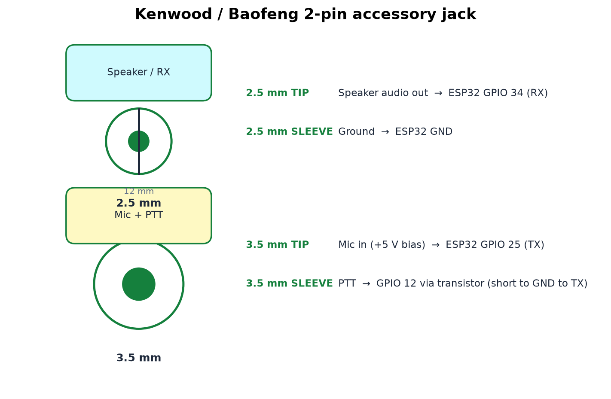
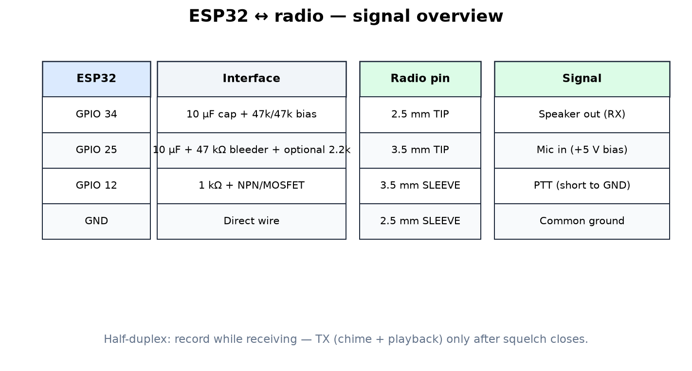
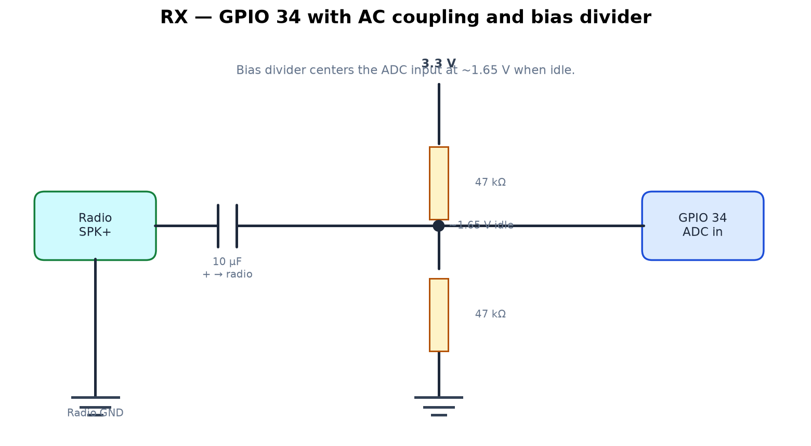
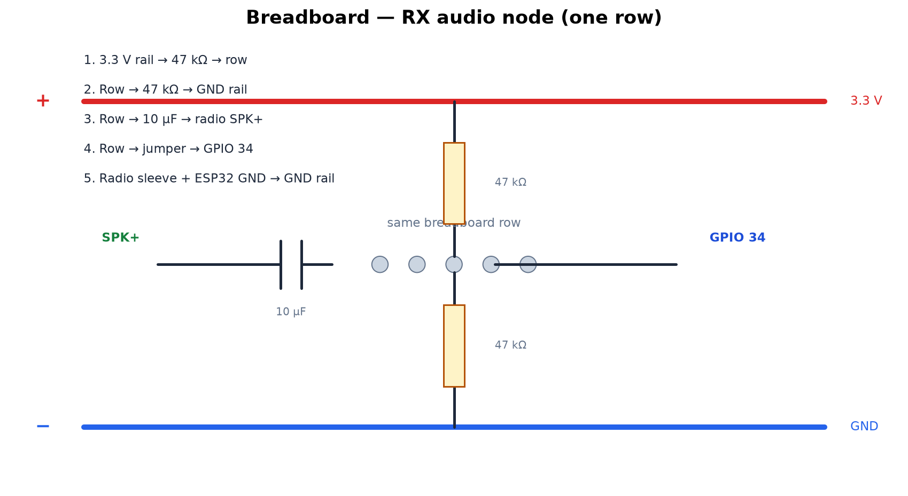
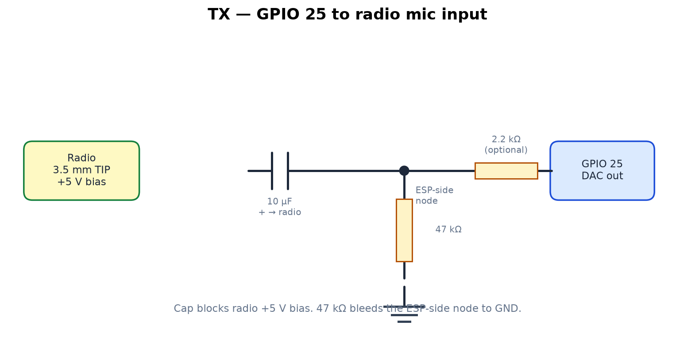
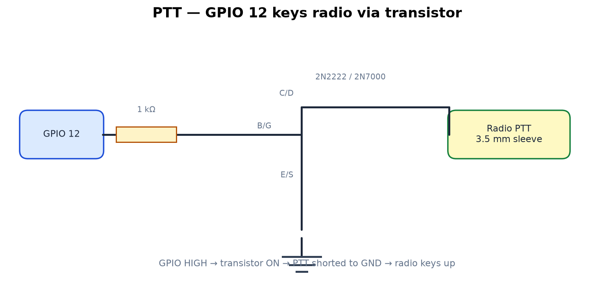

# ESPWiFi Ham Radio Wiring

This guide documents how to connect a **classic ESP32** running the ESPWiFi auto-responder firmware to a **Kenwood / Baofeng 2-pin** radio (for example the Baofeng UV-5R).

Firmware defaults (see `src/main.cpp`):

| ESP32 pin | Function |
|-----------|----------|
| **GPIO 34** | RX audio in (ADC) |
| **GPIO 25** | TX audio out (DAC) |
| **GPIO 12** | PTT output |

---

## Radio connector

The accessory jack uses two plugs spaced about **12 mm** apart:



| Plug | Pin | Signal |
|------|-----|--------|
| **2.5 mm** | Tip | Speaker audio out (use for **RX**) |
| **2.5 mm** | Sleeve | Ground |
| **3.5 mm** | Tip | Mic in (~**+5 V bias**) |
| **3.5 mm** | Sleeve | **PTT** — short to ground to transmit |

---

## System overview



Half-duplex rule enforced in firmware: the ESP32 **records while RX is active**, then waits for the line to return to idle before keying PTT for chime + playback.

---

## RX audio — GPIO 34

Tap the **2.5 mm speaker tip** for received audio. AC-couple with a **10 µF** cap and bias the ADC input to **~1.65 V** with a resistor divider.



### Schematic

```
Radio SPK+ (2.5 mm tip) ──[10µF]──┬── GPIO 34
                                  │
                                 [47k] ── 3.3 V
                                  │
                                 [47k] ── GND

Radio GND (2.5 mm sleeve) ────────┴── ESP32 GND
```

### Breadboard audio node

Use one row as the junction for the cap, both resistors, and the GPIO 34 jumper:



### Notes

- Use **film or ceramic** 10 µF if possible. If electrolytic, **+** toward the **radio**.
- Idle level at GPIO 34 should sit near **1.6–1.7 V** when no signal is present.
- During RX, level swings away from 1.65 V; firmware detects that deviation to start/stop recording.
- **Do not** call `readAnalog(34)` while `adc_continuous` recording is active — the firmware skips polling during capture.

---

## TX audio — GPIO 25

Drive the **3.5 mm mic tip**. Block the radio’s DC bias with a **10 µF** series cap.



### Schematic

```
GPIO 25 ──[optional 2.2k–4.7k]──┬──[10µF]── 3.5 mm TIP (mic)
                                │            (+ on cap toward radio)
                               [47k]
                                │
                              ESP GND

Radio 2.5 mm sleeve ─────────────── ESP GND (common ground)
```

### Notes

- The **10 µF cap** blocks the radio’s **+5 V mic bias** from reaching the ESP32 DAC.
- The **47 kΩ to ESP GND** sits on the **ESP-side node** (between the optional series resistor and the cap). It bleeds the coupling cap and gives the DAC output a DC path to ground when idle.
- If transmitted audio is **distorted or too loud**, increase the optional **series** resistor (try 4.7k, then 10k).
- Do **not** tie the mic tip directly to ESP GND — only key PTT (3.5 mm **sleeve**) to ground via the transistor.

---

## PTT — GPIO 12

Key the radio by shorting **3.5 mm sleeve** to ground. Use a small NPN transistor or logic-level MOSFET — do **not** connect GPIO 12 directly to the PTT pin.



### Schematic (NPN example)

```
GPIO 12 ──[1k]── base (2N2222)
                 emitter ── GND
                 collector ── 3.5 mm SLEEVE (PTT)
```

Firmware sets `audioPttPin = 12` and keys PTT automatically during DAC playback.

---

## microSD card (optional) — SPI / VSPI

The **esp32u** build uses `ESPWiFi_SDCARD_MODEL_ESP32U` (see `include/SDCardPins.h` and `platformio.ini`). Wire a **SPI microSD breakout** to the ESP32 **VSPI** pins so they do not overlap the radio signals above:

| SD module | ESP32 pin | VSPI signal |
|-----------|-----------|-------------|
| **CS** | **GPIO 5** | VSPI CS0 |
| **SCK** | **GPIO 18** | VSPI CLK |
| **MOSI** (DI) | **GPIO 23** | VSPI MOSI |
| **MISO** (DO) | **GPIO 19** | VSPI MISO |
| **VCC** | **3.3 V** | — |
| **GND** | **GND** | — |

### Schematic

```
SD module          ESP32-U
─────────          ───────
  VCC  ──────────  3.3 V
  GND  ──────────  GND  (common with radio ground)
  CS   ──────────  GPIO 5
  SCK  ──────────  GPIO 18
  MOSI ──────────  GPIO 23
  MISO ──────────  GPIO 19
```

### Notes

- Use **3.3 V** on VCC when possible. Many breakouts accept 5 V via an onboard regulator, but ESP32 GPIO is **3.3 V only**.
- Format the card **FAT32** (≤32 GB is simplest). Firmware mounts it at **`/sd`**; internal flash LittleFS stays on `/`.
- **CD** (card detect), if present on the module, can be left unconnected.
- Do **not** use GPIO **6–11** (internal flash) or the radio pins **12**, **25**, or **34** for SPI.
- Keep jumper wires short; SPI is sensitive to long runs.

---

## Parts list

| Qty | Part | Purpose |
|-----|------|---------|
| 2 | 10 µF cap | AC coupling (RX + TX) |
| 3 | 47 kΩ resistor | RX bias divider (×2) + TX bleeder (×1) |
| 1 | 1 kΩ resistor | PTT base resistor |
| 1 | 2N2222 or 2N7000 | PTT switch |
| 1 | 2.2k–4.7k resistor (optional) | TX level trim |
| 1 | SPI microSD breakout (optional) | WAV/log storage on `/sd` |

---

## Regenerating diagrams

Diagrams are generated with Python + Matplotlib:

```bash
pip install matplotlib
python .github/scripts/generate_radio_diagrams.py
```

Output is written to [`.github/docs/radio/`](docs/radio/).

---

## Troubleshooting

| Symptom | Likely cause | Fix |
|---------|--------------|-----|
| Idle RX reads ~0.14 V or pegged at 3.3 V | Missing bias divider | Add 47k/47k divider to ~1.65 V |
| Idle RX ~1.65 V but false triggers | Noise / EMI | Raise `kRxActiveDelta` or `kRxActiveHoldMs` in `main.cpp` |
| Playback sounds high/low pitch | WAV sample rate mismatch | `kRxWavSampleRate` in `Audio.cpp` (default 17746 Hz for classic ESP32 ADC) |
| TX audio distorted | Level too high for mic input | Add/increase series resistor before cap |
| No TX | PTT not shorting sleeve to GND | Verify transistor wiring and GPIO 12 |
| SD not detected / invalid pin config | Wrong build env or wiring | Flash `esp32u` with `ESPWiFi_SDCARD_MODEL_ESP32U`; check VSPI pins 5/18/19/23 |
| SD mount fails | Card format or power | Use FAT32; verify 3.3 V and common GND |

---

## Safety

- Connect **ground first** between radio and ESP32.
- Keep **RX (GPIO 34)** on **ADC1** pins only (GPIO 32–39 on classic ESP32).
- Never apply **>3.3 V** to any ESP32 GPIO.
- Test at low TX power first.
